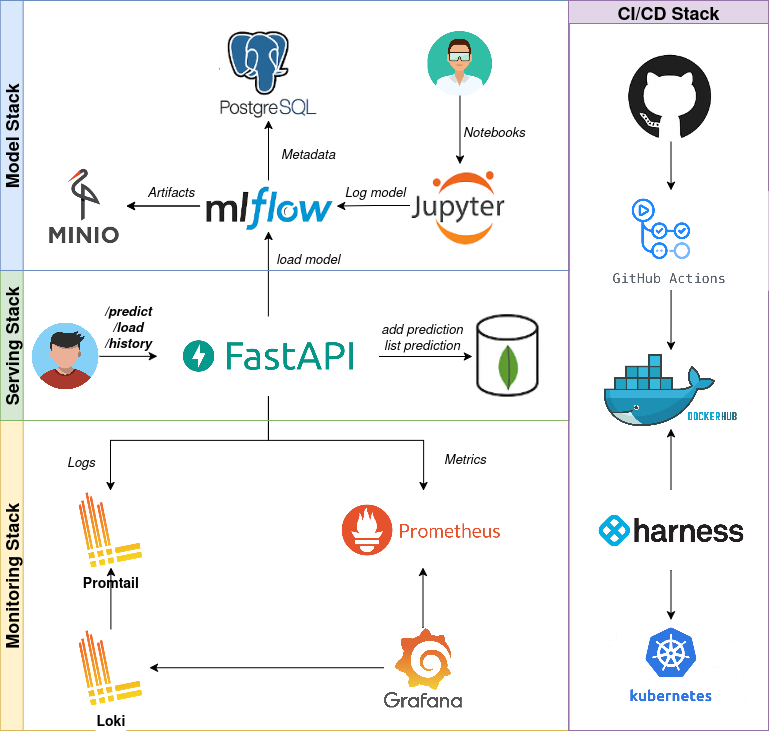

# Projeto de Predição com FastAPI, MLflow e MongoDB

Este projeto implementa uma API de predição utilizando **FastAPI**, com versionamento e deploy de modelos via **MLflow**, armazenamento de histórico de predições em **MongoDB**, e integração com o **Docker** para ambiente padronizado.

## Arquitetura da Solução



- Acesse o Grafana(http://localhost:3000) para dashboards de monitoramento.
- Acesse o MongoExpress(http://localhost:8081) para visualizar o histórico de predições.
- Acesse o MLflow(http://localhost:5000) para visualizar os modelos logados e registrá-los manualmente adicionando o alias "champion" para o modelo vencedor
- Acesse o FastAPI(http://localhost:8000) para realizar predições, pegar histórico e carregar novos modelos

## 🐳 Como rodar localmente com Docker

1. Clone o repositório:

```bash
git clone https://github.com/MateusPires94/InsiderProject.git
cd InsiderProject
```

2. Suba os containers:

```bash
make up
```

> Certifique-se de que os `.env` em /mlflow-docker e /fastapi estão corretamente configurados com as variáveis de ambiente segundo o `.env-example`.

3. Configure o Grafana:

- Entre no Grafana(http://localhost:3000)
- Estabeleça a conexão com o Prometheus (url:http://prometheus:9090, name: Prometheus)
- Estabeleça a conexão com o Loki (url:http://loki:3100, name: Loki)


## 🔬 Rodando os testes

Para rodar os testes dentro do container:

```bash
make test
```
## 🐳 Logando um Modelo

Antes de começar suas predições, você precisa logar um modelo no MLflow:

- Utilize um JupiterLab local.
- Log um modelo vide exemplo em Notebooks/titanic.ipynb.
- Entre no MLflow(http://localhost:5000) e registre esse modelo. Em seguida, entre na versão registrada e coloque o Alias "champion".

## Integração Contínua

Este projeto utiliza **GitHub Actions** para:

- Buildar imagem Docker
- Rodar testes com Pytest
- Publicar imagem no Docker Hub (para tags que começam com `model*`)

# Obrigado pelo desafio!
